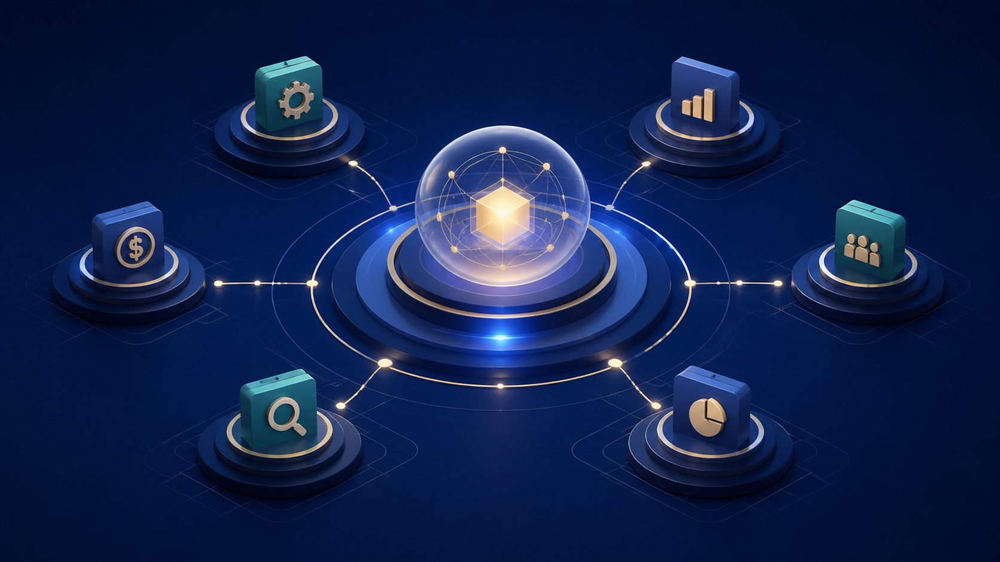

<div align="center">



# AI Co-Founder for Orgo

### One clear leader. A coordinated AI team. More time to build the business.

AI Co-Founder combines the operating discipline of **Head of Ops** with the
commercial focus of **Revenue Partner**, then gives each specialist a clear
role, durable work queue, and safe way to collaborate.

[**Start the walkthrough →**](START-HERE.md) ·
[Give this link to another AI](AGENTS.md) ·
[Managed agent stack](docs/MANAGED-AGENT-STACK.md) ·
[Update every agent](docs/FLEET-UPDATES.md) ·
[Meet the team](docs/TEAM.md) ·
[See the architecture](docs/ARCHITECTURE.md) ·
[Understand A2A](docs/A2A.md)

</div>

<div align="center">

[](https://github.com/jbellsolutions/ai-cofounder-orgo/actions/workflows/ci.yml)
[](docs/ORGO-SETUP.md)
[](https://github.com/NousResearch/hermes-agent/releases/tag/v2026.8.31)
[](docs/A2A.md)
[](docs/PERMISSIONS.md)
[](LICENSE)

</div>

---

## A company operating system you can talk to

Tell the Co-Founder what outcome matters. It turns that into owned work,
routes it to the right leaders, watches the dependencies, asks for evidence,
and returns with decisions instead of a pile of disconnected agent messages.

| **Think like a co-founder** | **Run like an operator** | **Grow like a revenue team** |
|---|---|---|
| Strategy, priorities, scorecards, tradeoffs, decisions, and resource allocation | Projects, calendars, inboxes, documents, proposals, systems, follow-up, and operating cadence | Offer fit, pipeline, affiliates, partnerships, campaigns, CRM, proposals, and revenue experiments |

The owner remains the final authority. The Co-Founder may research, plan,
draft, delegate, and coordinate inside its approved boundaries. Spending,
contracts, pricing exceptions, external publishing, sensitive disclosure,
infrastructure changes, and destructive actions stop for approval.

## The founding team

```text
Human Founder
└── AI Co-Founder
    ├── Head of Operations
    ├── Revenue Partner
    │   └── Affiliate Revenue Partner
    ├── Finance & Risk Lead
    └── Research & Analysis Lead
```

These are not disposable prompt fragments. Each role is a separate
[Hermes profile](https://hermes-agent.nousresearch.com/docs/user-guide/profiles)
with its own identity, memory, sessions, skills, configuration, and credentials.
The initial team is installed once; the Co-Founder then wakes the right people
through Bot Mode, A2A, and the durable Kanban board.

[See the complete responsibility map →](docs/TEAM.md)

## Talk, work, and authority stay separate

This design uses three complementary systems:

1. **Bot Mode and A2A for conversation.** Agents discover one another, consult,
   negotiate, and exchange results. Every profile is addressable over the
   authenticated A2A gateway.
2. **Kanban for durable work.** Owners, dependencies, reviews, retries,
   artifacts, and status survive restarts instead of disappearing into chat.
3. **Policy for authority.** A message from another agent is a request, not an
   approval. The machine-readable permission matrix decides what may proceed.

That creates full communication with hierarchical control: everyone can talk;
only authorized roles can assign work; no agent can approve its own sensitive
action or expand its own permissions.

## One link starts the build

Give a setup agent this repository:

```text
https://github.com/jbellsolutions/ai-cofounder-orgo
```

Then say:

```text
Install AI Co-Founder from this repository on my Orgo computer. Read AGENTS.md
and START-HERE.md first. Handle the technical work yourself and walk me through
only private sign-ins and approvals, one step at a time. Finish only when the
team profiles, Kanban board, A2A cards, and a real Slack or Telegram message
all pass verification.
```

The repository includes a machine-readable [`llms.txt`](llms.txt), an exact
Orgo contract, hidden-input connection helpers, tests, and a definition of
done so a new AI chat can begin without needing this conversation.

## What installs

| Layer | Included |
|---|---|
| Private computer | Persistent Orgo Linux computer built on the maintained Hermes template |
| Executive | AI Co-Founder as the owner-facing default profile |
| Leadership | Head of Ops, Revenue Partner, Affiliate Revenue Partner, Finance & Risk, and Research & Analysis |
| Coordination | Hermes Bot Mode, durable Kanban tasks, profile descriptions, reviews, and handoffs |
| A2A | One authenticated gateway with a separate Agent Card and route for every profile |
| Agent Factory | Controlled proposals and activation from approved templates; no autonomous deletion or infrastructure spending |
| Managed stack | Honcho memory for every profile, Agent Bundle company identity, and Latitude traces/evaluations |
| Fleet updates | Canary-first Orgo and DigitalOcean releases with exact commits, health gates, and local rollback |
| Business tools | Guided Calendar, inbox, Drive, CRM, and app connection through Composio plus PandaDoc proposals |
| Channels | Slack Agent view and Telegram, connected to the Co-Founder by default |
| Safety | Role-specific toolsets, manual approvals, peer allowlists, anti-loop limits, audit logs, and an emergency stop |

## Two deployment shapes

**Webinar / compact:** one Orgo computer runs the Co-Founder and all five named
profiles through a single multiplexed gateway. This is the default walkthrough.

**Production / funding edition:** keep the Co-Founder core separate, run the
leadership team on a Team Hub, and connect the existing Funding Revenue Partner
as a private A2A peer. The fourth Startup-plan computer slot stays available
for a regulated or high-load worker fleet.

Profiles provide separate agent state, not an operating-system sandbox. Roles
that require materially different secrets or filesystem trust belong on
separate computers. [Architecture details →](docs/ARCHITECTURE.md)

## Simple installation

1. Create an Orgo computer named `ai-guy-cofounder` from
   `system/hermes-agent@1.0.0`.
2. Clone this repository and run `./orgo/setup.sh`.
3. Connect the model with `hermes setup`.
4. Run `./orgo/create-team.sh` to create the leadership profiles.
5. Connect Honcho, Agent Bundle, and Latitude with
   `./orgo/connect-agent-stack.sh`.
6. Connect Slack or Telegram with `./orgo/connect-channels.sh`.
7. Connect Calendar, inbox, CRM, and proposals with
   `./orgo/connect-tools.sh`.
8. Add private cross-computer peers with `./orgo/connect-a2a.sh`.
9. Run `./orgo/verify.sh` and complete the real-message test.

The screen-by-screen version is [START-HERE.md](START-HERE.md).

## Documentation

| Guide | What it answers |
|---|---|
| [Start Here](START-HERE.md) | How a first-time owner gets from GitHub to a working team |
| [Setup-agent brief](AGENTS.md) | The full autonomous handoff for another AI chat |
| [Architecture](docs/ARCHITECTURE.md) | Computers, profiles, gateways, workflow state, and trust boundaries |
| [Team](docs/TEAM.md) | Who owns what and who reports to whom |
| [A2A](docs/A2A.md) | Agent Cards, routing, peer security, negotiation, and testing |
| [Agent Factory](docs/AGENT-FACTORY.md) | How new roles are proposed, approved, created, tested, and retired |
| [Permissions](docs/PERMISSIONS.md) | Autonomy, approval tiers, deny rules, and the audit record |
| [Orgo setup](docs/ORGO-SETUP.md) | Exact computer contract and deployment proof |
| [Orgo reference](docs/ORGO-REFERENCE.md) | Applied `llms.txt`, API discipline, templates, and plan boundary |
| [Slack](docs/SLACK-SETUP.md) | Manifest, private tokens, allowlist, and live test |
| [Telegram](docs/TELEGRAM-SETUP.md) | Bot token, owner allowlist, and direct-message test |
| [Tools](docs/TOOLS.md) | Calendar, inbox, Drive, CRM, proposals, and safe first tests |
| [Managed agent stack](docs/MANAGED-AGENT-STACK.md) | Honcho, Agent Bundle, Latitude, A2A, ownership, and privacy |
| [Fleet updates](docs/FLEET-UPDATES.md) | One-request updates across Orgo and DigitalOcean with canary and rollback |
| [Skills](docs/SKILLS.md) | Shared and role skills, updates, review, and safe installation |
| [Operations](docs/OPERATIONS.md) | Daily brief, weekly business review, emergency stop, backup, and updates |
| [Verification](docs/VERIFICATION.md) | Automated checks and live acceptance tests |

AI Co-Founder is an operating partner, not a legal officer, fiduciary, or
signatory. It does not promise business outcomes. Connected services activate
only after their real credentials and permissions are configured.

MIT licensed. This project is not affiliated with Orgo, Nous Research, Slack,
Telegram, Composio, PandaDoc, OpenRouter, or Tailscale.
